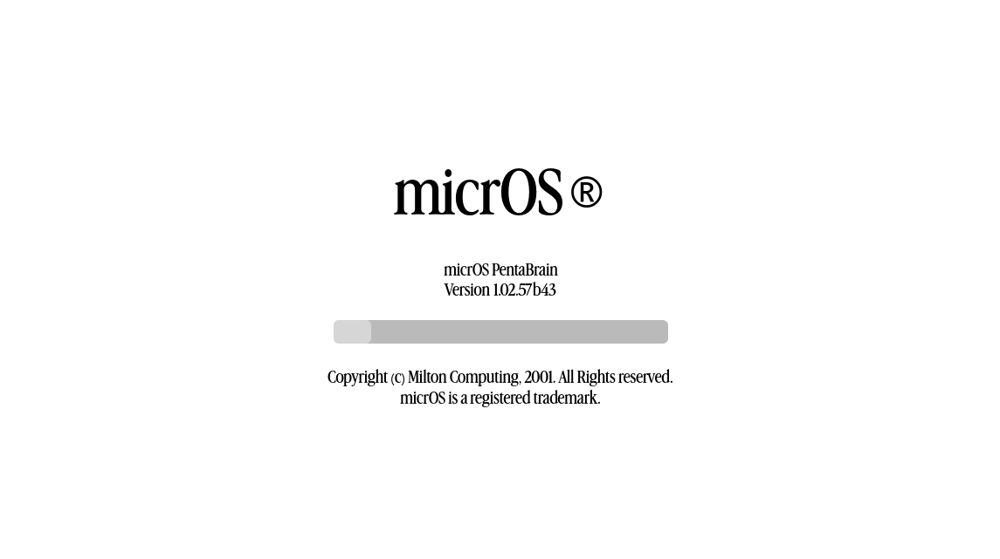
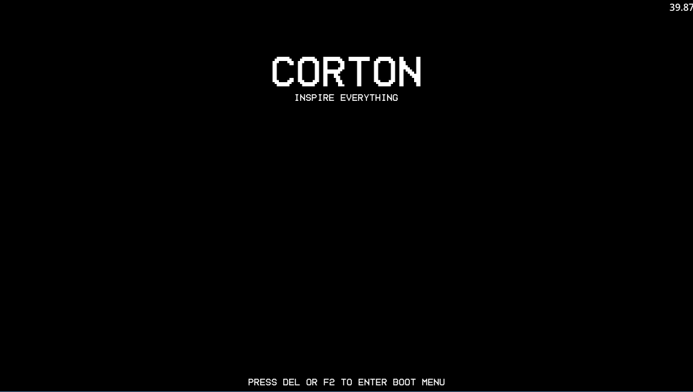
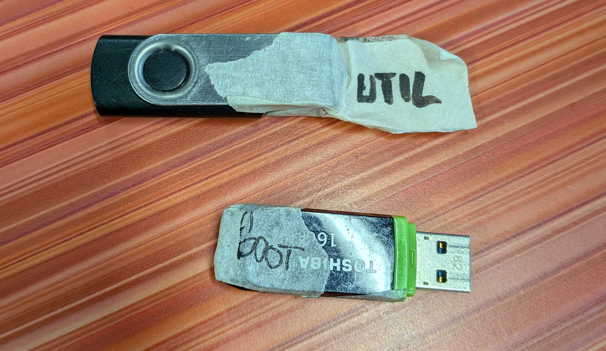
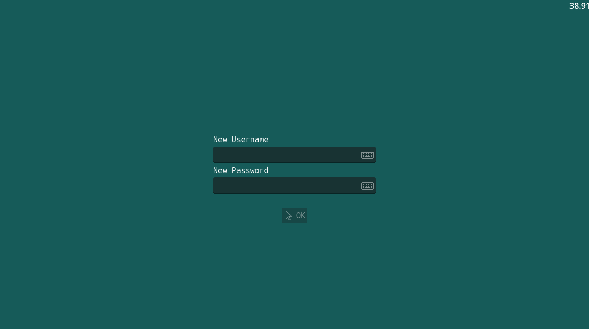
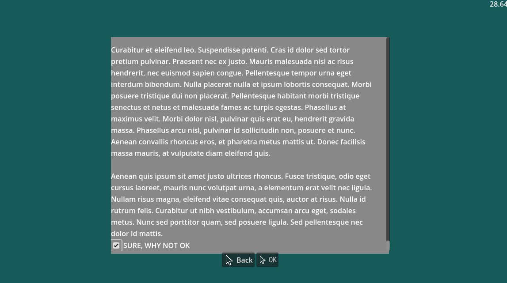
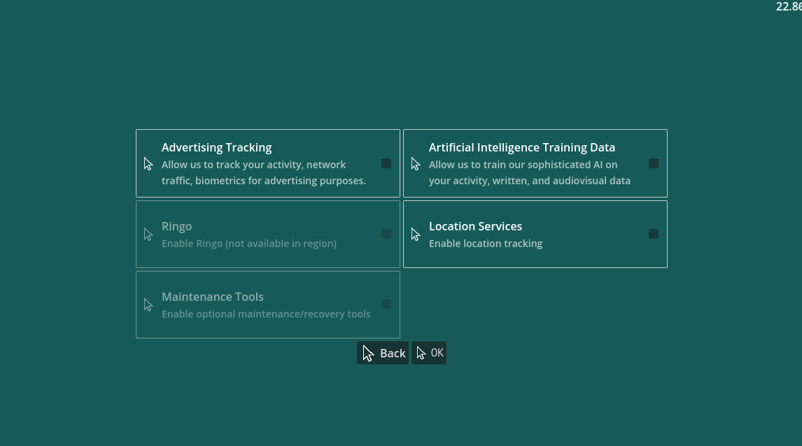

# Game-A-Week 2026: Week 3

| |  
|---|---|


> Game-A-Week is an intensive program in which participants will create 6 prototype games or works - one each week. The aims of Game-A-Week are multifaceted and center around the benefits of “sketching” - something not practiced as often in games as other arts. With your “sketches”, you’ll practice working on small scope ideas, experimenting in a low stakes and supportive environment, practice receiving feedback and help discover and develop your own taste as an artist. Drawing influence from game jams, Game-A-Week will prompt you with weekly thematic, aesthetic, or mechanical constraints (e.g. “time” or “black-and-white” or “one-button input”).


## Theme: One Input

> We’re approaching an old classic with a new lens - some of you may remember weird input. This week, we wanted to create a theme that encouraged unique approaches to input but with more specificity. So, we’re focusing on ONE input this week. The constraint being that you can choose any singular type of input, be it one button, a trigger, a joystick, motion controls, touch, or anything else your mind can think of, and be restrained to ONLY that input for your projects this week!


## Game: micrOS

*This write-up was written after GAW26 concluded, with more retrospective notes*



Week 3 continued my historic run of not finishing a game and not showing up on game day. I got very in my head about creating a polished looking game, and grappling with being unsure whether my game was entertaining or tedious. However, much like week 2, retrospectively I'm pretty stoked with what I managed to get going. 

My interpretation of this theme was to treat the single USB port on my laptop as my one input to work with, building a game where players would have to rapidly switch out peripherals to complete a number of tasks. This bring back memories of my time in tech support, having to grapple with limited inputs on cheap hardware. To this day I can't look at multi eth/usb-a/usb-c to usb-c adapters without shuddering. Yuck.



Players are entrusted with booting up an unknown system. They will be expected to swap between an external USB keyboard, mouse, and two specifically crafted USB drives. UI design was based on a mix of Windows and various Linux builds, and I think they look pretty flash! Coming up with names for tech is also pretty fun. I tend to pick something off the dome and stick with it.

I puzzled over the best way to read USB drives, and found that I wasn't able to allow users to access files from them, since they would have no way to input directions to select said files. Further, I didn't want to rely on just naming the device, being unsure how different systems would handle this info. I settled for hosting a DRIVEINFO files on each USB, similar to the below. 

```
[DriveInfo]
Name="BOOTDRIVE"
```



When the game needed to check for the USB's presence, it checks all the attached drives for this DRIVEINFO file, and pulls the Name field. This worked really well in the end. I used this feature to simulate booting into an operating system, and if the user removes the USB mid-boot, it immediately fails the load, and they're sent back to the start. Boot screen is given a varying range of loading speeds, to simulate a sloooooow process chain. I'm not showing you how I hardcoded this.



Once booted up, players are expected to set up a user account, agree to some dodgy terms, and enable various ad-riddled system features. You love advertising. You love it. Past this point, I never completed, but theoretically, spin up would fail if the user hadn't selected Maintenance Tools, which are only available if you created your user account as RECOVERY:RECOVERY. The game would have theoretically come with a manual that explains all this. I love peripheral prop manuals for games.



Past this point, I wanted to step away from the tedious back and forth tracking of setting up an OS, and pivot to microgame style interactions, where players had a limited time to complete interactions requiring specific input styles. This included clicking/dragging rapidly to spin up computer fans, slamming keys to speed up data processing, etc. I never ended up finishing these, womp womp. 



I have foudn that I really enjoy creating simulations of real computer systems. I think this is really evident between this project, and [Untitled Computer Demo](https://umconfortable.itch.io/untitled-computer-demo), which has the player interact between various PC systems, while blasting music in their little hacker room.

Despite not finishing, I consider this week a success, ending up with a pretty sleak looking demo of my ideal end game, which I could build off of in future. 

## Acknowledgements
- people who use computers
- it technicians everywhere
- jaxson, who i rambled about this idea to a bit